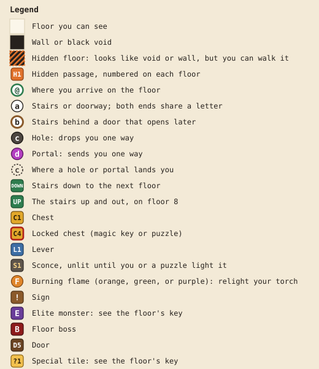
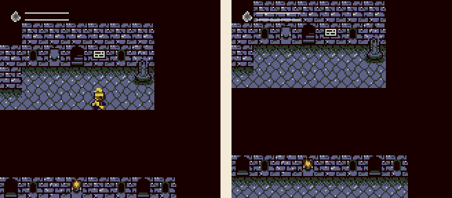

# Walkthrough

A floor-by-floor guide to Labyrinth of the Dragon, with a map and a route for every floor. For the basics without spoilers, see the [player's manual](../README.md).

| Floor | Boss | Needs level | Elite and reward | Keys found / locks | Hidden passages |
|---|---|---|---|---|---|
| [1](floor-1.md) | Goblin | 8 | None (a hidden kobold instead) | 1 / 1 | 3, one required |
| [2](floor-2.md) | Owlbear | 15 | Bugbear: ability 1 | 2 / 2 | 2 |
| [3](floor-3.md) | Gelatinous cube | 18 | Zombie: ability 2 | 1 / 2 | 6, four required |
| [4](floor-4.md) | Displacer beast | 24 | Owlbear: ability 3 | 1 / 2 | 2 |
| [5](floor-5.md) | Death knight | 32 | Gelatinous cube: ability 4 | 2 / 3 | 6, one required |
| [6](floor-6.md) | Mind flayer | 34 | Will-o-wisp: ability 5 | 2 / 3 | 2 |
| [7](floor-7.md) | Beholder | 36 | Displacer beast: a haste potion, an ATK up, and a DEF up | 2 / 2 | 6 and the secret stairs, four required |
| [8](floor-8.md) | The dragon | none | Beholder: required | 0 / 0 | 1 |

"Needs level" is the level a boss asks for before it will fight. Below it, the boss sends you away with a taunt.

The chapters rate monsters from one star (★) to four (★★★★). More stars mean a tougher monster for its level, and one worth more XP. Each rating gives the monster its own colors, listed in the [bestiary](bestiary.md#colors).

## Reference

- [Battle](battle.md): hitting and damage, running away, when random fights start, healing, and status effects, in numbers.
- [Heroes](heroes.md): experience, where it runs out, and when each class's abilities arrive and grow.
- [Bestiary](bestiary.md): every monster's weaknesses, resistances, immunities, and tricks.

## Reading the maps

- The maps are drawn from the game's own data, so they match the game tile for tile.
- Positions are written (x,y): x counts columns from the left edge, starting at 0, and y counts rows from the top, starting at 0. The numbers are printed around every map.
- Floors with two maps label them A and B. A position like B(3,5) is on map B.
- Chests, sconces, levers, signs, and mirrors sit in the wall. Stand on the floor tile next to one, face it, and press A. A monster works the same way: face it and press A to start the fight.
- The chapters call each lever, sconce, and switch by where it is or what it does, with its pin after the name, as in the west lever (L2).
- Directions like "up 2, right 3" mean two steps up, then three steps right. The chapters give them for hidden passages and anywhere else the way is easy to miss. A hidden passage's steps start from the side you reach first, so walk them in reverse to come back.
- Each exit has a letter, and both ends of a two-way stair share it. A hole or portal takes you one way only, and a dashed ring with its letter marks where you land. A brown ring around a letter means the exit is behind a door that opens later.

## Hidden passages

Some tiles that look like the black void around the labyrinth, or now and then like a wall, are floor you can walk on. Your hero disappears while crossing them and reappears on the other side. In the picture, the hero stands below a sign on floor 1, then takes one step down onto a hidden passage.

The maps hatch these tiles orange and number the passages H1, H2, and so on. There are 28 of them across the eight floors, plus a pair of secret stairs on floor 7 that look like void too. You can't finish the game without them: floor 1's magic key, most of floor 3, floor 5's boss, and the keys and switches in floor 7's wings are all behind hidden passages.

A few signs hint at them: "Check behind you..." on floor 1, and "The walls have secrets..." and "You feel a strong breeze from the north." on floor 5. Elsewhere, look for a chest you can see but can't reach, a corridor that ends in darkness, or an empty room.

## Magic keys

A magic key opens one locked door or chest, and the lock uses it up. Keys you don't use carry over to the next floor.

The labyrinth has 11 keys and 15 locks, so at least four locks stay shut on any run. Floors 3 to 6 each have one more locked chest than keys:

| Floor | Keys | Locks |
|---|---|---|
| 1 | C2 | Door a, the treasure room with the torch. Required. |
| 2 | C3, C4 | Door b, the elite (ability 1). Door c, the item room (2 potions, 1 remedy). |
| 3 | C1 | C4, a regen potion. C5, a remedy. |
| 4 | C3 | C5, a regen potion. C6, a haste potion. |
| 5 | C3, C4 | C5, 3 ethers. C6, 1 elixir. C7, an ATK up and a DEF up. |
| 6 | C2, C3 | C4, 3 potions. C5, 3 regen potions. C6, 3 ethers. |
| 7 | C1, C2 | Doors D5 and D7, each opened by the key from its own wing. Required. |

A lock you skip saves its key for a later one. The first choice comes on floor 2, where the item room holds 2 potions and a remedy, and its sign warns "Soon you will have to choose."

## Before you go down

- Every stairway down is one-way, so you can't go back for anything you left behind. If you die, you start again from floor 1 with every floor restocked, except floor 8's healing mirrors, which stay used. See [if you fall](../README.md#if-you-fall).
- Each elite from floor 2 to floor 6 teaches your class a new ability. The elites are optional, but the later bosses are much harder without those abilities.
- On every floor with random encounters, the monsters get tougher once you pass a set level. Each chapter lists both sets.
