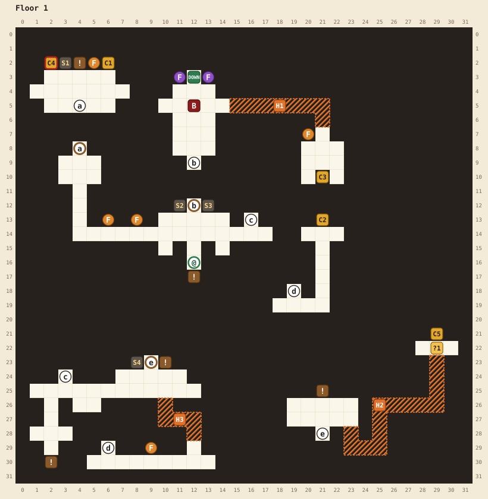

# Floor 1

[Walkthrough](README.md) | Next: [Floor 2](floor-2.md)

You start with no torch and no keys. The torch is in a locked room, and the floor's only magic key is past a hidden passage, so finding that passage comes first.

## At a glance

| | |
|---|---|
| Arrival | (12,16), a dead end below the main corridor |
| Boss | Goblin, level 10, ★★★★, at (12,5). It won't fight you below level 8. |
| Elite | None. The lair is empty, but a hidden kobold (level 10, ★★★) guards chest C5. |
| Chests | 5: the torch, a magic key, 1 potion, 2 potions, 1 ether |
| Magic keys | 1 found, 1 lock |
| Hidden passages | 3. H3 is required. |
| Random encounters | Kobolds and goblins of levels 5 to 9, and a level 9 zombie once you reach level 9 |

## Map

See the [legend](README.md#reading-the-maps) for the symbols.

| Pin | Where | What |
|---|---|---|
| @ | (12,16) | Where you arrive |
| a | (4,8) and (4,5) | Door to the treasure room. Needs a magic key. |
| b | (12,12) and (12,9) | Boss door. Opens when sconces S2 and S3 both burn. |
| c | (16,13) and (3,24) | Stairs between the main corridor and the lower level |
| d | (6,29) and (19,18) | Secret door between the bottom corridor and the magic key chamber |
| e | (9,23) and (21,28) | Stairs up to the empty elite lair. Opens when the lair sconce (S4) burns. |
| DOWN | (12,3) | Stairs to floor 2. Opens when the boss falls. One-way. |
| C1 | (6,2) | The torch |
| C2 | (21,13) | Magic key |
| C3 | (21,10) | 1 potion |
| C4 | (2,2) | 2 potions. Locked until you light the treasure room sconce (S1). |
| C5 | (29,21) | 1 ether |
| S1 | (3,2) | The treasure room sconce. Lighting it unlocks C4: "The chest clicks." |
| S2, S3 | (11,12), (13,12) | The boss door's sconces, one each side of it |
| S4 | (8,23) | The lair sconce, on the lower level. Opens stairs e |
| F | Orange: (5,2), (6,13), (8,13), (9,29), (20,7). Purple: (11,3), (13,3). | Burning flames |
| ! | (12,17) | "The tunnel has collapsed behind you!" |
| ! | (4,2) | "Monsters fear fire." |
| ! | (10,23) | "Check behind you..." |
| ! | (2,30) | "It's empty..." |
| ! | (21,25) | "A powerful foe once lived here." |
| B | (12,5) | The goblin boss |
| ?1 | (29,22) | Stepping here starts the hidden kobold fight, once each time you enter the floor |
| H1, H2, H3 | | Hidden passages, below |

## Hidden passages

| Passage | Start at | Walk | Leads to |
|---|---|---|---|
| H3 | (10,25), just below the sign that says "Check behind you..." | down 2, right 2, down 2 | The bottom corridor at (12,29): the secret door d and flame F (9,29). **Required**: the only way to the magic key. |
| H1 | (14,5), the right edge of the boss room | right 7, down 2 | A side room with C3 and flame F (20,7) |
| H2 | (23,27), the bottom right corner of the elite lair | down 2, right 2, up 3, right 4, up 4 | The kobold's tile ?1 and chest C5 |

## Route

1. **Look around.** The sign behind you at (12,17) reads "The tunnel has collapsed behind you!" Walk up into the main corridor. Its two orange flames and the boss door's sconces are no use until you have the torch.
2. **Go down to the lower level.** Take stairs c at (16,13), at the corridor's right end. You come out at (3,25).
3. **Find the first hidden passage.** Walk right along the corridor to (10,24) and face up to read the sign: "Check behind you..." Turn around. The tile below you, (10,25), is plain floor, and the dark tile under that is a passage. From (10,25) walk down 2, right 2, down 2. Your hero disappears while crossing and reappears at (12,29).
4. **Take the secret door.** Walk down to the bottom corridor, then left to (6,30), and step up onto d at (6,29). You arrive in the magic key chamber at (19,19). Walk right 2 and up 5 to (21,14), face up, and open C2: "You get a magic key!"
5. **Head back up.** Return through d, walk back through H3 (up 2, left 2, up 2 from (12,29)), and take stairs c up to the main corridor.
6. **Open the treasure room.** Walk left to the end of the corridor and up to door a at (4,8). Face it and press A: "You unlock the door with a magic key!" Inside:
   - The sign at (4,2): "Monsters fear fire."
   - C1 at (6,2): "You find a torch!" While it burns, random monsters leave you alone.
   - The orange flame at (5,2): face it to light your torch.
   - The treasure room sconce (S1) at (3,2): light it, and C4 at (2,2) unlocks ("The chest clicks."). It holds 2 potions.
7. **Open the boss door.** Back in the main corridor, relight your torch from the flame at (6,13) or (8,13) if it has gone out, then light the boss door's two sconces, S2 (11,12) and S3 (13,12). Door b opens once both burn.
8. **Detour through H1 (optional).** Go through b into the boss room. The goblin at (12,5) turns you away until you reach level 8 ("Get out of here, runt!"). From (14,5), at the room's right edge, walk right 7 and down 2 to reach the side room with C3 (1 potion) and an orange flame.
9. **The elite lair and the hidden kobold (optional).** On the lower level, light the lair sconce (S4) at (8,23). Carry a flame down from the main corridor (about 15 steps by stairs c), or take the orange one at (9,29) on the bottom corridor (13 steps back through H3). Stairs e at (9,23) open and lead to the empty lair, where the sign at (21,25) reads "A powerful foe once lived here." From the lair's bottom right corner, (23,27), take H2: down 2, right 2, up 3, right 4, up 4. The last step lands on (29,22) and starts a fight with a level 10, ★★★ kobold. Win, then face up to open C5 (1 ether). Leave the way you came.
10. **Beat the boss.** You need level 8, and level 10 makes it a fair fight. The goblin has four stars, the most a monster can have, so arrive with potions. When it falls it shouts "Yawp! You won't beat my friends below!" and the stairs behind it open.
11. **Leave.** Your first step onto (12,4), in front of the stairs, warns "There is no going back!" The stairs are one-way, so collect everything first.

## Notes

- The torch holds a flame for a limited number of steps. See [the torch](../README.md#the-torch-and-sconces) in the manual.
- The hidden kobold comes back each time you enter floor 1, including after a death. See [if you fall](../README.md#if-you-fall).
