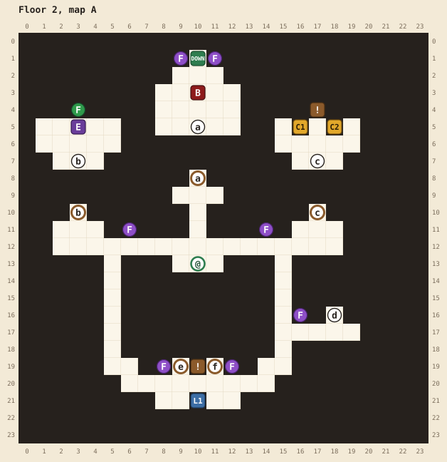
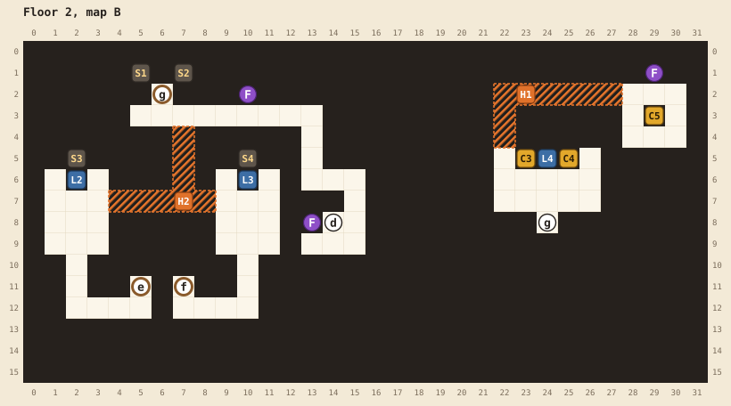

# Floor 2

[Walkthrough](README.md) | Previous: [Floor 1](floor-1.md) | Next: [Floor 3](floor-3.md)

Map A, the upper level, has the boss, the elite, and an item room. Map B, below it, has the levers that open the boss door. This is also where you find your first magic keys and decide which doors to spend them on.

## At a glance

| | |
|---|---|
| Arrival | (10,13), in the middle of the long hall on map A |
| Boss | Owlbear, level 19, ★★★★, at A(10,3). It won't fight you below level 15. |
| Elite | Bugbear, level 20, ★★★, at A(3,5). Beating it teaches your first ability. |
| Chests | 5: 2 potions, 1 remedy, 2 magic keys, 1 potion |
| Magic keys | 2 found, 2 locks (the elite room and the item room) |
| Hidden passages | 2, both on map B. Neither is required, but H2 saves a lot of walking. |
| Random encounters | Goblins, kobolds, and zombies of levels 9 to 12; levels 14 and 15 once you reach level 16 |

## Maps

See the [legend](README.md#reading-the-maps) for the symbols. Stairs d, e, and f join the two maps.

| Pin | Where | What |
|---|---|---|
| @ | A(10,13) | Where you arrive |
| a | A(10,8) and A(10,5) | Stairs to the boss. The door opens when you pull the key room lever (L4) on map B. |
| b | A(3,10) and A(3,7) | Door to the elite's room. Needs a magic key. |
| c | A(17,10) and A(17,7) | Door to the item room. Needs a magic key. |
| d | A(18,16) and B(14,8) | Stairs between the hall and map B's north corridor |
| e | A(9,19) and B(5,11) | Stairs to map B's west lever room. Open when you arrive. |
| f | A(11,19) and B(7,11) | Stairs to map B's east lever room. Closed when you arrive. |
| g | B(6,2) and B(24,8) | Door to map B's east side. Opens when the west and east levers (L2 and L3) have both been pulled. |
| DOWN | A(10,1) | Stairs to floor 3. Opens when the boss falls. One-way. |
| C1 | A(16,5) | 2 potions |
| C2 | A(18,5) | 1 remedy |
| C3 | B(23,5) | Magic key |
| C4 | B(25,5) | Magic key |
| C5 | B(29,3) | 1 potion |
| L1 | A(10,21) | The swap lever, under the sign. Swaps stairs e and f: whichever is open closes and the other opens. Pull it as often as you like. |
| L2 | B(2,6) | The west lever. Lights S1 and S3 green. Works once. |
| L3 | B(10,6) | The east lever. Lights S2 and S4 green. Works once. |
| L4 | B(24,5) | The key room lever, between the two key chests. Opens the boss door a: "Somewhere a door opens..." Works once. |
| S1 to S4 | B(5,1), B(7,1), B(2,5), B(10,5) | The lever lights. They show which of the west and east levers you've pulled. |
| F | Purple: A(9,1), A(11,1), A(6,11), A(14,11), A(16,16), A(8,19), A(12,19), B(10,2), B(13,8), B(29,1). Green: A(3,4). | Burning flames. Nothing on this floor needs your torch. |
| ! | A(17,4) | "Soon you will have to choose." |
| ! | A(10,19) | "Levers change many things." |
| E | A(3,5) | The bugbear elite |
| B | A(10,3) | The owlbear boss |
| H1, H2 | | Hidden passages, below |

## Hidden passages

| Passage | Start at | Walk | Leads to |
|---|---|---|---|
| H2 | B(3,7), the east side of the west lever room | right 6 | The east lever room at B(9,7). A branch from B(7,7) runs up 4 to the north corridor at B(7,3), next to door g. |
| H1 | B(22,5), the top left corner of the key room | up 3, right 6 | A small room with C5 and a purple flame. Its first tile, B(22,4), looks like the bottom of the wall above it. |

H2 is a shortcut. Without it, reaching both lever rooms means climbing back to map A to swap the stairs with the swap lever (L1), and reaching door g means a third trip down stairs d.

## Route

1. **Look around.** The boss stairs a, straight up from where you arrive, are shut. Doors b (left) and c (right) need magic keys, which you don't have yet.
2. **Go down to the west lever room.** Walk down the left branch from the hall to the lever room at the bottom of map A. The sign at A(10,19) reads "Levers change many things." Stairs e, left of the sign, are open. Take them to map B.
3. **Pull the west lever.** In the west lever room, face up at B(2,7) and pull the west lever (L2) at B(2,6). Two green lights come on.
4. **Cross to the east lever room.** From B(3,7), walk right 6 through H2 to B(9,7). Without H2, climb back up, pull the swap lever (L1) to swap the stairs, and come down through f instead.
5. **Pull the east lever.** Face up at B(10,7) and pull the east lever (L3) at B(10,6). With both levers pulled, door g at B(6,2) opens.
6. **Go through door g.** From B(10,7), walk left 3 and up 4 through H2's branch to B(7,3), then left 1 and up onto g. Without H2, go back up to map A and take stairs d at A(18,16), which lead to the same corridor. You come out at B(24,7) on the east side.
7. **Open the key room.** Open C3 at B(23,5) and C4 at B(25,5): two magic keys. Pull the key room lever (L4) between them at B(24,5): "Somewhere a door opens..." That was the boss door.
8. **Take H1 for C5 (optional).** From the room's top left corner, B(22,5), walk up 3 and right 6 through H1, then one more step right to stand over C5. Face down to open it: 1 potion.
9. **Go back up.** Return through door g, then up any open stairs.
10. **Spend the keys.** Door b leads to the bugbear elite. Door c leads to the item room: C1 (2 potions), C2 (1 remedy), and the sign "Soon you will have to choose." From floor 3 on, there are more locked chests than keys, so a key you save here opens a chest later. See [magic keys](README.md#magic-keys).
11. **Beat the boss.** Stairs a are open now. You need level 15. The owlbear greets you with "SCREEEEEECH!" Like floor 1's goblin, it has four stars, and for its level it's the toughest boss before the dragon. At level 15 it beats most heroes, and at 17 it still often beats a fighter or a sorcerer, so come at 18 or higher, with potions.
12. **Beat the elite (optional, recommended).** The bugbear (level 20, ★★★) is one level above the boss. Fight it last, after the boss and a few more levels. It opens with "An adventurer? Come, let's test your mettle!", and beating it teaches your class its first ability.
13. **Leave.** Take the stairs DOWN at A(10,1). There's no way back.
