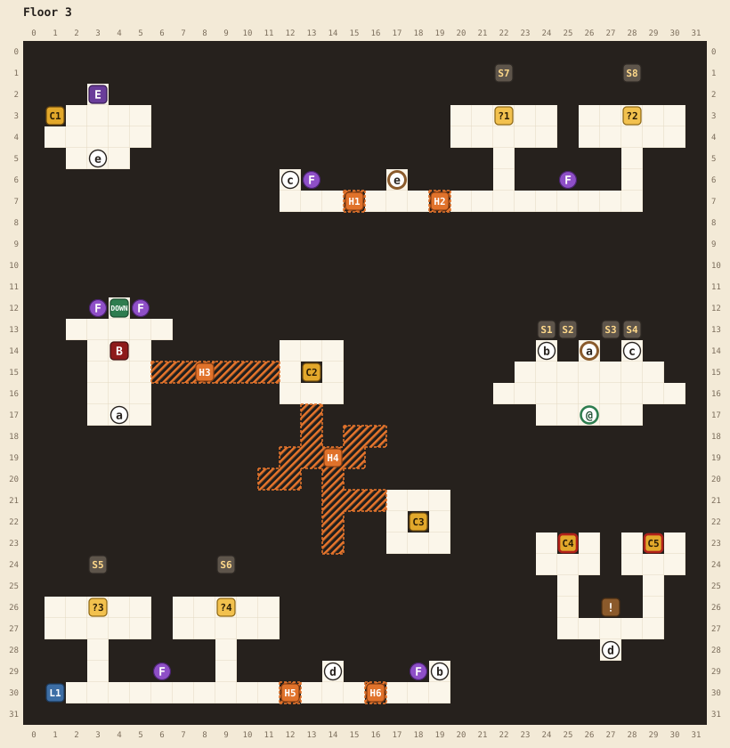

# Floor 3

[Walkthrough](README.md) | Previous: [Floor 2](floor-2.md) | Next: [Floor 4](floor-4.md)

Both of this floor's long corridors seem to end in darkness, but each dead end is a one-tile hidden passage, and almost everything on the floor lies past them. The boss door opens once you've pressed the skull buttons in all four corners.

## At a glance

| | |
|---|---|
| Arrival | (26,17), in the room below the boss door |
| Boss | Gelatinous cube, level 24, ★★★★, at (4,14). It won't fight you below level 18. |
| Elite | Zombie, level 21, ★★, at (3,2). Beating it teaches your class its second ability. |
| Chests | 5: a magic key, 1 potion, 1 ether, a regen potion (locked), a remedy (locked) |
| Magic keys | 1 found, 2 locks (both chests in the south room) |
| Hidden passages | 6. H1, H2, H5, and H6 are required. |
| Random encounters | Kobolds, zombies, goblins, and bugbears of levels 17 to 23 |
| Special fights | A level 19, ★★ goblin guard waits on the bones in front of each skull button, once each time you enter the floor |

## Map

See the [legend](README.md#reading-the-maps) for the symbols.

| Pin | Where | What |
|---|---|---|
| @ | (26,17) | Where you arrive |
| a | (26,14) and (4,17) | Door to the boss. Opens when all four skull buttons have been pressed. |
| b | (24,14) and (19,29) | Stairs to the south corridor |
| c | (28,14) and (12,6) | Stairs to the north corridor |
| d | (14,29) and (27,28) | Stairs from the south corridor up to the locked chests |
| e | (17,6) and (3,5) | Door to the elite's room. Opens when you pull the south corridor's lever (L1). |
| DOWN | (4,12) | Stairs to floor 4. Opens when the boss falls. One-way. |
| C1 | (1,3) | Magic key |
| C2 | (13,15) | 1 potion |
| C3 | (18,22) | 1 ether |
| C4 | (25,23) | 1 regen potion. Needs a magic key. |
| C5 | (29,23) | 1 remedy. Needs a magic key. |
| L1 | (1,30) | The south corridor's lever, at its west end. Opens door e: "Somewhere a door opens..." Works once. |
| S1 to S4 | (24,13), (25,13), (27,13), (28,13) | The boss door's four sconces, one per skull button |
| S5 to S8 | (3,24), (9,24), (22,1), (28,1) | The skull above each button. It lights with its button. |
| F | Purple: (13,6), (25,6), (3,12), (5,12), (6,29), (18,29) | Burning flames. Nothing on this floor needs your torch. |
| ! | (27,26) | "Choose, but choose wisely..." |
| E | (3,2) | The zombie elite |
| B | (4,14) | The gelatinous cube boss |
| ?1, ?2 | (22,3), (28,3) | The two north skull buttons. Stand on one, face up, and press A. |
| ?3, ?4 | (3,26), (9,26) | The two south skull buttons |
| H1 to H6 | | Hidden passages, below |

## Hidden passages

| Passage | Start at | Walk | Leads to |
|---|---|---|---|
| H1 | (14,7), on the north corridor | right 2 | The rest of the north corridor: door e to the elite, then H2. **Required.** |
| H2 | (18,7), on the north corridor | right 2 | The corridor's east end and the two north skull rooms. **Required.** |
| H6 | (17,30), on the south corridor | left 2 | Stairs d to the locked chests, then H5. **Required.** |
| H5 | (13,30), on the south corridor | left 2 | The two south skull rooms and the south corridor's lever (L1). **Required.** |
| H3 | (5,15), the boss room's right wall | right 7 | The room with C2. Its first tile, (6,15), looks like the edge of the wall. |
| H4 | (13,16), the bottom of C2's room | down 3, right 1, down 2, right 4 | C3, opened from (18,21) facing down |

H1, H2, H5, and H6 are each a single tile where the corridor seems to end. Walk straight through.

## Route

1. **Look at the boss door.** The four sconces above door a are unlit. Each one lights when you press a skull button in one of the floor's corners, and the two corridors below lead to them.
2. **Take the south corridor.** Go down stairs b at (24,14). You arrive at (19,30) at the east end of the south corridor. Walk left: the corridor seems to stop at (17,30), but H6 carries on through (16,30).
3. **The locked chests (optional).** Stairs d at (14,29) lead up to a small room with C4 (a regen potion), C5 (a remedy), and the sign "Choose, but choose wisely..." Both chests need a magic key. You'll find only one key on this floor, in the elite's room, plus any you saved on floor 2. See [magic keys](README.md#magic-keys).
4. **The south skull buttons.** Keep walking left through H5 at (12,30). The corridor's two branches lead up to the two south skull rooms. Step onto the bones in the middle of each room's top row, ?4 at (9,26) and ?3 at (3,26): the first step onto each starts a fight with a goblin guard, and the bones dim once it has fought. Then face up and press A. The skull above lights, and so does one of the boss door's sconces.
5. **Pull the lever.** At the corridor's west end, face left from (2,30) to pull the south corridor's lever (L1) at (1,30): "Somewhere a door opens..." That was door e, on the north corridor.
6. **Take the north corridor.** Go back to the arrival room (east along the south corridor, then stairs b) and take stairs c at (28,14). You arrive at (12,7). Walk right through H1 at (15,7).
7. **The elite (optional, recommended).** Door e at (17,6) is open now. Inside, open C1 at (1,3), a magic key, and face the zombie at (3,2). It groans "BRAIINNNNSS..." and teaches your class its second ability when it falls.
8. **The north skull buttons.** Back on the corridor, walk right through H2 at (19,7). Take the branches up to the two north skull rooms and press the buttons ?1 at (22,3) and ?2 at (28,3) the same way, each after its goblin guard. With the fourth button, "Somewhere a door opens..."
9. **Beat the boss.** Go back to the arrival room and through door a. You need level 18; below it the cube only jiggles at you ("Jiggle?"). A fighter wants a few more levels than the others here.
10. **Collect C2 and C3 (optional).** In the boss room, walk right 7 from (5,15) through H3 to C2's room, and face right at (12,15) to open C2 (1 potion). From (13,16), at the bottom of that room, take H4: down 3, right 1, down 2, right 4. Face down at (18,21) to open C3 (1 ether).
11. **Leave.** The stairs DOWN at (4,12) are at the top of the boss room.

## Notes

- Once you reach level 21, the random encounters jump to levels 19 to 23, including a ★★★ zombie and a bugbear with two goblins. With a goblin fight at every skull button too, bring plenty of potions.
- The goblin guards, and their bright bones, return each time you enter the floor. Once a button is pressed, it stays pressed.
