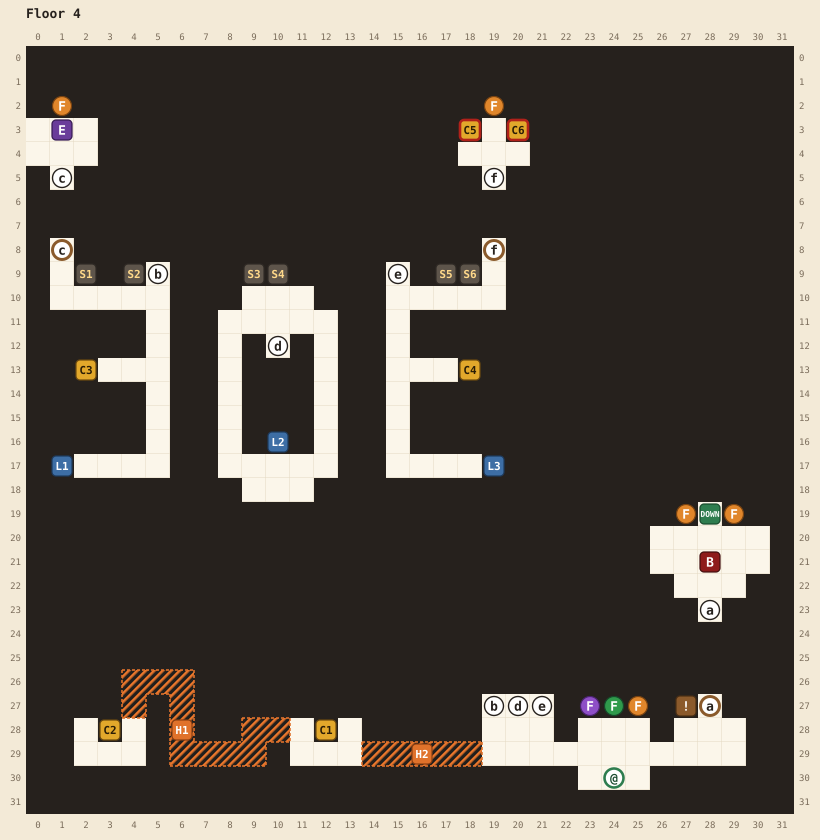

# Floor 4

[Walkthrough](README.md) | Previous: [Floor 3](floor-3.md) | Next: [Floor 5](floor-5.md)

This floor has two puzzles, both spread across its three wings. Set the wings' levers right and the elite's room and the treasure room open. Light each wing's pair of sconces in the right color and the boss door opens. Two hidden chests lie west of the arrival hall.

## At a glance

| | |
|---|---|
| Arrival | (24,30), at the bottom of the arrival hall |
| Boss | Displacer beast, level 33, ★★★, at (28,21). It won't fight you below level 24. |
| Elite | Owlbear, level 31, ★★, at (1,3). Beating it teaches your class its third ability. |
| Chests | 6: 1 potion, 1 ether, a magic key, 1 ether, a regen potion (locked), a haste potion (locked) |
| Magic keys | 1 found, 2 locks (both chests in the treasure room) |
| Hidden passages | 2, both optional |
| Random encounters | Goblins, zombies, bugbears, and owlbears of levels 18 to 27; levels 28 to 31 once you reach level 29 |

## Map

See the [legend](README.md#reading-the-maps) for the symbols.

| Pin | Where | What |
|---|---|---|
| @ | (24,30) | Where you arrive |
| a | (28,27) and (28,23) | Door to the boss. Opens when all three sconce pairs burn the right color. |
| b | (19,27) and (5,9) | Stairs to the west wing |
| d | (20,27) and (10,12) | Stairs to the central wing |
| e | (21,27) and (15,9) | Stairs to the east wing |
| c | (1,8) and (1,5) | Door to the elite's room (west wing). Opens with the lever combination. |
| f | (19,8) and (19,5) | Door to the treasure room (east wing). Opens with the lever combination. |
| DOWN | (28,19) | Stairs to floor 5. Opens when the boss falls. One-way. |
| C1 | (12,28) | 1 potion |
| C2 | (3,28) | 1 ether |
| C3 | (2,13) | Magic key |
| C4 | (18,13) | 1 ether |
| C5 | (18,3) | 1 regen potion. Needs a magic key. |
| C6 | (20,3) | 1 haste potion. Needs a magic key. |
| L1 | (1,17) | The west wing lever. Must be left **off**. |
| L2 | (10,16) | The central wing lever. Must be **on**. |
| L3 | (19,17) | The east wing lever. Must be **on**. |
| S1, S2 | (2,9), (4,9) | The west wing's sconces. Must burn green. |
| S3, S4 | (9,9), (10,9) | The central wing's sconces. Must burn orange, for the red icon. |
| S5, S6 | (17,9), (18,9) | The east wing's sconces. Must burn purple, for the blue icon. |
| F | Purple (23,27), green (24,27), orange (25,27) | The three colored flames beside the arrival hall |
| F | Orange: (1,2), (19,2), (27,19), (29,19) | Other burning flames |
| ! | (27,27) | "Where a sconce is missing, take its color..." |
| E | (1,3) | The owlbear elite |
| B | (28,21) | The displacer beast boss |
| H1, H2 | | Hidden passages, below |

## Hidden passages

| Passage | Start at | Walk | Leads to |
|---|---|---|---|
| H2 | (19,29), the arrival hall's bottom row | left 6 | A small room with C1 |
| H1 | (11,28), the west side of C1's room | left 2, down 1, left 3, up 3, left 2, down 1 | (4,27), at the top of a second room with C2. Walk down 2 and left 1, then face up at (3,29) to open C2. |

## The flame puzzle

Each wing has three sconce spots with an icon above each, and one of the three spots has no sconce. Only the icon over the empty spot is in color: green in the west wing, red in the central wing, and blue in the east wing. Both sconces in the wing must burn the flame that answers to it, taken from the three beside the arrival hall. Those flames burn orange, green, and purple, so the red icon wants the orange flame and the blue icon the purple one. You can light both sconces from one flame.

A pair lit the wrong color goes out with an error sound, so you can try again. When the third pair is right, the boss door opens: "Somewhere a door opens..."

## The lever puzzle

The three wing levers start off. The elite's door c and the treasure door f open only while the west wing lever (L1) is off and the central and east wing levers (L2 and L3) are on. Any other combination shuts both doors again. So pull the central and east levers once each and leave the west one alone. If you pull it by mistake, pull it again.

## Route

1. **The hidden chests (optional).** From the arrival hall's bottom row at (19,29), walk left 6 through H2 to C1's room and open C1 (1 potion). From (11,28), the room's west side, take H1: left 2, down 1, left 3, up 3, left 2, down 1, then down 2 and left 1. Face up at (3,29) to open C2 (1 ether).
2. **Set the levers.** Take stairs d to the central wing and pull the central wing lever (L2) at (10,16), facing up from (10,17). Take stairs e to the east wing and pull the east wing lever (L3) at (19,17), facing right from (18,17). The second pull opens doors c and f: "Somewhere a door opens..." Open C4 (1 ether) at (18,13) while you're in the east wing.
3. **The treasure room.** From the east wing's arrival at (15,10), walk to (19,9) and step up through door f. C5 (a regen potion) and C6 (a haste potion) both need a magic key. The one on this floor is in the west wing.
4. **The west wing.** Take stairs b. Open C3 at (2,13), a magic key. Door c at (1,8), the wing's top left corner, leads to the owlbear elite: "KWAAAAAAHHH!" Beating it teaches your class its third ability.
5. **Solve the flames.** Take the green flame at (24,27), facing up from (24,28), and light the west wing's two sconces (S1 and S2). Take the orange flame at (25,27) and light the central wing's (S3 and S4). Take the purple flame at (23,27) and light the east wing's (S5 and S6). Each trip is well within one flame's life.
6. **Beat the boss.** Door a at (28,27), in the hall's east end, is open now. You need level 24, and the displacer beast fights at level 33. It greets you with "NyaAAAHHHH!"
7. **Leave.** The stairs DOWN at (28,19) are at the back of the boss room.
