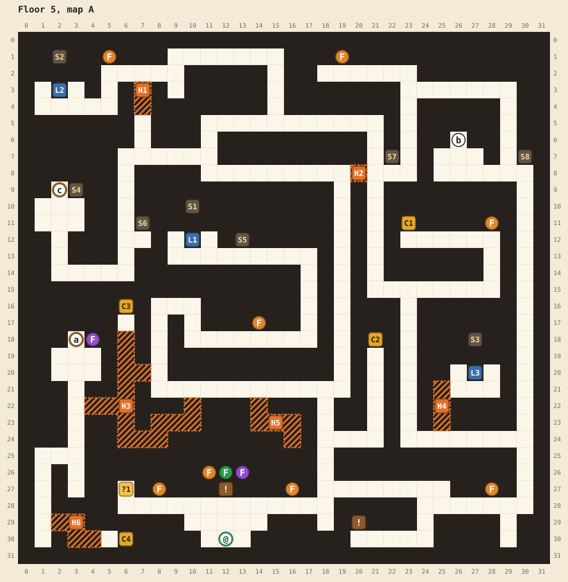
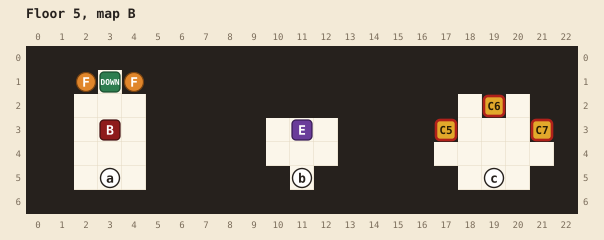

# Floor 5

[Walkthrough](README.md) | Previous: [Floor 4](floor-4.md) | Next: [Floor 6](floor-6.md)

Map A is one big maze, and map B has three small rooms under it: the treasure room, the elite's room, and the boss room. The boss stairs, two magic keys, and one of the three rainbow levers are behind hidden passages, as the sign "The walls have secrets..." warns. The other sign, "The Dragon demands a rainbow...", sets the floor's puzzle.

## At a glance

| | |
|---|---|
| Arrival | (12,30), at the bottom of the maze |
| Boss | Death knight, level 39, ★★★★, at B(3,3). It won't fight you below level 32. |
| Elite | Gelatinous cube, level 37, ★★, at B(11,3). Beating it teaches your class its fourth ability. |
| Chests | 7: 1 remedy, 3 potions, 2 magic keys, and in the treasure room 3 ethers, 1 elixir, and an ATK up with a DEF up |
| Magic keys | 2 found, 3 locks (all three treasure room chests) |
| Hidden passages | 6. H3 is required. |
| Random encounters | Zombies, owlbears, bugbears, and gelatinous cubes of levels 30 to 32; zombies, owlbears, gelatinous cubes, and goblins of levels 34 to 40 once you reach level 37 |

## Maps

See the [legend](README.md#reading-the-maps) for the symbols. Map B's three rooms don't connect to each other. Each has its own stairs up to the maze.

| Pin | Where | What |
|---|---|---|
| @ | A(12,30) | Where you arrive |
| a | A(3,18) and B(3,5) | Stairs to the boss. Open while the three rainbow sconces show orange, green, and purple. |
| b | A(26,6) and B(11,5) | Stairs to the elite. Always open. |
| c | A(2,9) and B(19,5) | Stairs to the treasure room. Open once the treasure room sconce (S4) burns. |
| DOWN | B(3,1) | Stairs to floor 6. Opens when the boss falls. One-way. |
| C1 | A(23,11) | 1 remedy |
| C2 | A(21,18) | 3 potions |
| C3 | A(6,16) | Magic key |
| C4 | A(6,30) | Magic key |
| C5 | B(17,3) | 3 ethers. Needs a magic key. |
| C6 | B(19,2) | 1 elixir. Needs a magic key. |
| C7 | B(21,3) | 1 ATK up and 1 DEF up. Needs a magic key. |
| L1 | A(10,12) | The middle rainbow lever. Sets S1. |
| L2 | A(2,3) | The northwest rainbow lever. Sets S2. |
| L3 | A(27,20) | The pocket rainbow lever, behind H4. Sets S3. |
| S1, S2, S3 | A(10,10), A(2,1), A(27,18) | The rainbow sconces, one above each lever, lit by pulling it |
| S4 | A(3,9) | The treasure room sconce. Opens stairs c when lit |
| S5 to S8 | A(13,12), A(7,11), A(22,7), A(30,7) | Optional sconces: S5 east of the middle lever, S6 west of it, and S7 and S8 in the northeast. They open nothing. |
| F | Orange: A(5,1), A(19,1), A(28,11), A(14,17), A(8,27), A(16,27), A(28,27), B(2,1), B(4,1). Purple: A(4,18). | Burning flames |
| F | A(11,26) orange, A(12,26) green, A(13,26) purple | The entrance flames over the rainbow sign. They show the answer's colors and never change. |
| ! | A(12,27) | "The Dragon demands a rainbow..." |
| ! | A(20,29) | "The walls have secrets..." |
| ?1 | A(6,27) | "You feel a strong breeze from the north." A hint at H3. |
| E | B(11,3) | The gelatinous cube elite |
| B | B(3,3) | The death knight boss |
| H1 to H6 | | Hidden passages, below |

## Hidden passages

| Passage | Start at | Walk | Leads to |
|---|---|---|---|
| H3 | (8,20), at the top of the short spur above the maze's south corridor | left 2, up 3 | (6,17), the nook below chest C3 |
| H3 | (8,20) | left 2, down 2, left 3 | The west column at (3,22), and from there the boss stairs a, the room with C4, and the lower west maze. **Required.** |
| H6 | (1,29), the bottom of the west column | right 2, down 1, right 2 | (5,30), in front of C4 |
| H4 | (25,24), south of the pocket lever (L3) | up 3, right 1 | (26,21). One more step right puts you under L3. |
| H1 | (7,2) | down 3 | A two-tile shortcut to (7,5). |
| H2 | (19,8) | right 2 | A one-tile shortcut to (21,8) |
| H5 | (14,21) | down 1 | A small dead end. Nothing is in it. |

H3 is one shaft down the column at x=6, from (6,18) to (6,24), with branches east and west. It has a third way in, from (10,21) on the south corridor, and you'll cross it more than once.

## The rainbow

Each rainbow lever cycles its sconce through orange, green, and purple, one color per pull, and wraps from purple back to orange. The boss stairs open while the three sconces read, in order, orange, green, purple:

| Lever | Pull it | Its sconce shows |
|---|---|---|
| L1, the middle lever at (10,12) | once | orange |
| L2, the northwest lever at (2,3) | twice | green |
| L3, the pocket lever at (27,20) | three times | purple |

Each lever needs as many pulls as its number. If you overshoot, keep pulling until the color comes around again. The levers reset every time you arrive on the floor.

## Route

1. **Read the signs.** "The Dragon demands a rainbow..." is right in front of you at (12,27). "The walls have secrets..." is a short walk east, at (20,29).
2. **The four maze chests.** Open C1 (1 remedy) and C2 (3 potions) in the maze's east half. Then head for C3 at (6,16) in the west. You can see it, but its nook is reachable only through H3: from (8,20), walk left 2 into the shaft and up 3. C4 at (6,30), in the southwest corner, is past H3's west branch and then H6. The tile at (6,27) with the breeze message sits a few tiles south of the shaft.
3. **Open the treasure room.** Take a flame from the orange one at (5,1) in the northwest corner and light the treasure room sconce (S4) at (3,9). Stairs c at (2,9) open. All three chests below need a magic key, and this floor gives you two: bring a third from an earlier floor to open them all. See [magic keys](README.md#magic-keys).
4. **The elite (optional, recommended).** Stairs b at (26,6), in the maze's northeast, lead to the gelatinous cube: "JIGGLE!" Beating it teaches your class its fourth ability.
5. **The optional sconces.** S5 to S8 open nothing. If you want them all lit, the shortest trips are:
   - S5, from the flame at (14,17): 12 steps.
   - S6, from the flame at (5,1): 12 steps.
   - S7 and S8, both from the flame at (19,1): 9 and 15 steps. The orange flame at (28,11) looks closer to S8, but the walk is 34 steps and the flame goes out on the way.
6. **Solve the rainbow.** Pull the middle lever (L1) once, the northwest lever (L2) twice, and the pocket lever (L3) three times. L3 sits in a pocket you enter through H4: from (25,24), walk up 3 and right 2, then face up. When the third sconce shows its color: "Somewhere a door opens..."
7. **Beat the boss.** Boss stairs a at (3,18) are at the top of the west column, reached through H3. You need level 32. Below it, the death knight says "You are... unworthy." Its greeting is "Come and meet DEATH!" Once per fight, a killing blow has a 3 in 16 chance to leave it standing with a quarter of its HP.
8. **Leave.** The stairs DOWN at B(3,1) open behind the boss.

Exact steps

Each line starts where the previous one ended, standing in front of the named object. "Face" is the direction to press before A.

| To | From | Steps | Then face |
|---|---|---|---|
| Sign (12,27) | Arrival, (12,29) | up 1 | up |
| Sign (20,29) | (12,28) | right 6, up 1, right 6, down 3, left 4 | up |
| Breeze tile (6,27) | (20,30) | right 4, up 3, left 6, down 1, left 12, up 1 | |
| C1 (23,11) | (6,27) | down 1, right 12, up 7, right 1, up 13, right 2, down 7, right 7, up 3, left 5 | up |
| C2 (21,18) | (23,12) | right 5, down 3, left 7, up 7, left 2, down 13, left 1, down 3, right 3, up 5 | up |
| C3 (6,16) | (21,19) | down 5, left 3, up 3, left 10, up 1, left 2, up 3. The last 5 steps cross H3. | up |
| C4 (6,30) | (6,17) | down 5, left 3, down 3, left 2, down 4, right 2, down 1, right 2. Crosses H3, then H6. | right |
| Flame (5,1) | (5,30) | left 2, up 1, left 2, up 4, right 2, up 3, right 3, up 2, right 2, down 1, right 11, up 13, left 8, up 1, left 4, up 5, left 2 | up |
| S4 (3,9), the treasure room sconce | (5,2) | right 2, down 5, left 1, down 7, left 4, up 4, right 1 | up |
| Stairs c (2,9) | (3,10) | left 1, up 1 | |
| Stairs b (26,6) | (2,10) | down 4, right 4, up 7, right 5, down 1, right 12, up 5, right 6, down 5, left 2, up 1, left 1, up 1 | |
| S5 (13,12) | Flame (14,17), from (14,18) | right 3, up 5, left 4 | up |
| S6 (7,11) | Flame (5,1), from (5,2) | right 2, down 5, left 1, down 4 | right |
| S7 (22,7) | Flame (19,1), from (19,2) | right 4, down 5 | left |
| S8 (30,7) | Flame (19,1), from (19,2) | right 4, down 1, right 6, down 4 | right |
| L1 (10,12), the middle lever | (29,7) | up 4, left 6, down 5, left 4, down 13, left 11, up 5, right 2, down 2, right 7, up 5, left 7 | up |
| L2 (2,3), the northwest lever | (10,13) | right 7, down 5, left 7, up 2, left 2, down 5, right 11, up 13, left 8, up 1, left 4, up 5, left 2, down 2, left 3 | up |
| L3 (27,20), the pocket lever | (2,4) | right 3, up 2, right 2, down 5, right 4, down 1, right 10, down 7, right 2, down 9, right 2, up 3, right 2. Crosses H1, H2, and H4. | up |
| Boss stairs a (3,18) | (27,21) | left 2, down 3, right 5, down 4, left 5, up 1, left 7, up 6, left 10, up 1, left 2, down 2, left 3, up 4. Crosses H4 and H3. | |

