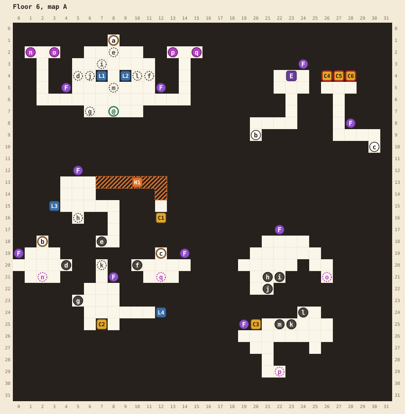
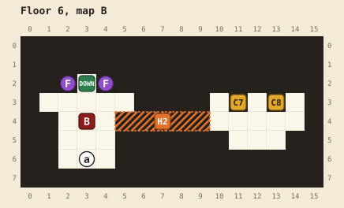

# Floor 6

[Walkthrough](README.md) | Previous: [Floor 5](floor-5.md) | Next: [Floor 7](floor-7.md)

The two levers in the arrival room decide which of four portal pads works, and each pad sends you to a different sealed-off part of the floor. From there, holes lead to more rooms or drop you back in the arrival room. The boss door needs two more levers, each in a room you can only reach this way.

## At a glance

| | |
|---|---|
| Arrival | (8,7), in the arrival room at the top of map A |
| Boss | Mind flayer, level 45, ★★★, at B(3,4). It won't fight you below level 34. |
| Elite | Will-o-wisp, level 43, ★★, at A(23,4). Beating it teaches your class its fifth and last ability. |
| Chests | 8: 1 elixir, 2 magic keys, 3 potions (locked), 3 regen potions (locked), 3 ethers (locked), 1 potion, 1 ether |
| Magic keys | 2 found, 3 locks (the treasure room's three chests) |
| Hidden passages | 2, both optional |
| Random encounters | Will-o-wisps, gelatinous cubes, owlbears, and bugbears of levels 39 to 44; gelatinous cubes, owlbears, displacer beasts, goblins, and a kobold of levels 41 to 47 once you reach level 43 |

## Maps

See the [legend](README.md#reading-the-maps) for the symbols. Portals are magenta and holes are dark gray. A dashed ring with the same letter marks where each one drops you. Most holes land you back in the arrival room.

| Pin | Where | What |
|---|---|---|
| @ | A(8,7) | Where you arrive |
| n, o, p, q | A(1,2), A(3,2), A(13,2), A(15,2) | The four portal pads. Only the live one glows, and only it works. See below. |
| a | A(8,1) and B(3,6) | Door to the boss. Opens when the elite lever (L3) and the treasure lever (L4) have both been pulled. |
| b | A(2,18) and A(20,9) | Stairs to the elite. The door opens when you pull the elite lever (L3). |
| c | A(12,19) and A(30,10) | Stairs to the treasure room. The door opens when you pull the treasure lever (L4). |
| d, g | A(4,20), A(5,23) | Holes back to the arrival room |
| e | A(7,18) | Hole from the elite lever's room back to the arrival room |
| f | A(10,20) | Hole from the treasure stairs landing back to the arrival room |
| h | A(21,21) | Hole to the elite lever's room, landing at A(5,16) |
| i, j | A(22,21), A(21,22) | Holes back to the arrival room |
| k | A(23,25) | Hole to the treasure lever's room, landing at A(7,20) |
| l, m | A(24,24), A(22,25) | Holes back to the arrival room |
| DOWN | B(3,2) | Stairs to floor 7. Opens when the boss falls. One-way. |
| C1 | A(12,16) | 1 elixir |
| C2 | A(7,25) | Magic key |
| C3 | A(20,25) | Magic key |
| C4, C5, C6 | A(26,4), A(27,4), A(28,4) | 3 potions, 3 regen potions, 3 ethers. Each needs a magic key. |
| C7 | B(11,3) | 1 potion |
| C8 | B(13,3) | 1 ether |
| L1, L2 | A(7,4), A(9,4) | The portal levers, L1 on the left and L2 on the right. They switch on and off as often as you like. |
| L3 | A(3,15) | The elite lever. Opens stairs b to the elite, and with L4 the boss door |
| L4 | A(12,24) | The treasure lever. Opens stairs c to the treasure room, and with L3 the boss door |
| F | Purple: A(4,5), A(12,5), A(5,12), A(0,19), A(14,19), A(8,21), A(22,17), A(19,25), A(24,3), A(28,8), B(2,2), B(4,2) | Burning flames. Nothing on this floor needs your torch. |
| E | A(23,4) | The will-o-wisp elite |
| B | B(3,4) | The mind flayer boss |
| H1, H2 | | Hidden passages, below |

## The portals

The left portal lever (L1) and the right one (L2) start down. Each pull flips one of them, and together they pick the live pad:

| Left lever (L1) | Right lever (L2) | Live pad | Takes you to |
|---|---|---|---|
| down | down | n, A(1,2) | The west landing, A(2,20): stairs b to the elite, and hole d home |
| up | down | o, A(3,2) | The northeast landing, A(26,20): hole h to the elite lever's room, and holes i and j home |
| down | up | p, A(13,2) | The southeast landing, A(21,29): chest C3, hole k to the treasure lever's room, and holes l and m home |
| up | up | q, A(15,2) | The treasure landing, A(12,20): stairs c to the treasure room, and hole f home |

After each pull the glow moves to the new live pad. Every portal and hole is one-way, but you always have a hole or stairs back to the arrival room.

## Hidden passages

| Passage | Start at | Walk | Leads to |
|---|---|---|---|
| H1 | A(6,13), the top right of the elite lever's room | right 6, down 2 | A(12,15), above C1: face down to open it |
| H2 | B(4,4), right of the boss | right 6 | A secret room with C7 and C8. Its first tile, B(5,4), looks like the edge of the wall. |

## Route

1. **Southeast first.** Pull the right portal lever (L2) at (9,4) so that only it is up, and step onto pad p at (13,2), reached up the column at x=14. You land at A(21,29). Walk up to open C3 at (20,25), a magic key, then step into hole k at (23,25).
2. **The treasure lever's room.** You drop to A(7,20). Open C2 at (7,25), a magic key, and pull the treasure lever (L4) at (12,24), facing right from (11,24). With only one of the two levers pulled, you're told "Another lever still holds this door!" Step into hole g at (5,23) to drop back to the arrival room.
3. **Northeast.** Set the portal levers so that only the left one (L1) is up, and take pad o at (3,2), up the column at x=2. You land at A(26,20). Walk left and step into hole h at (21,21).
4. **The elite lever's room.** You drop to A(5,16). From (6,13), the room's top right, walk right 6 and down 2 through H1, and face down to open C1 (1 elixir). Pull the elite lever (L3) at (3,15), facing left from (4,15): "Somewhere a door opens..." That opens both the elite's stairs and the boss door. Step into hole e at (7,18) to drop back to the arrival room.
5. **The elite (optional, recommended).** Put both portal levers down and take pad n at (1,2). From the landing, stairs b at (2,18) lead to the will-o-wisp: "BZZZTTT!" Beating it teaches your class its fifth ability. Come back down the stairs and take hole d at (4,20) home.
6. **The treasure room (optional).** Put both portal levers up and take pad q at (15,2). Stairs c at (12,19) lead to C4, C5, and C6, which need three magic keys between them. This floor gives you two. See [magic keys](README.md#magic-keys). Hole f at (10,20) takes you home.
7. **Beat the boss.** Door a at (8,1), at the top of the arrival room, leads to map B. You need level 34; below it the mind flayer says "You have yet to ripen..." Its greeting is "OH! What a delicious brain!"
8. **The secret room (optional).** From B(4,4), just right of where the boss stood, walk right 6 through H2 to open C7 (1 potion) and C8 (1 ether).
9. **Leave.** The stairs DOWN at B(3,2) open behind the boss.

## Notes

- You can do steps 3 and 4 before steps 1 and 2. The boss door opens once the elite and treasure levers are both pulled.
- Once the mind flayer has confused you, its Extract Brain can kill you outright, so cure confusion at once. See the [bestiary](bestiary.md).
