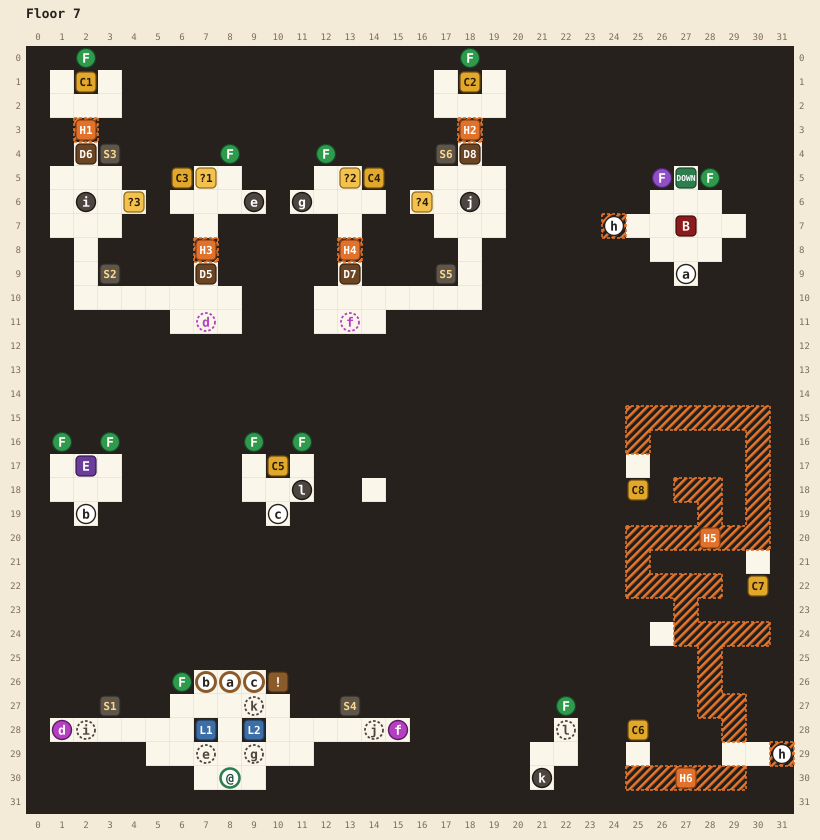

# Floor 7

[Walkthrough](README.md) | Previous: [Floor 6](floor-6.md) | Next: [Floor 8](floor-8.md)

Two levers in the lever hall open the way to the boss, but both start stuck. A switch deep in each wing frees one, and each wing is a small puzzle of sconces, switches, and doors, with a hidden passage behind every door. Once both levers are free, they work a lock of three eyes over three doors. The boss room also hides a stairway to a secret maze made almost entirely of hidden tiles.

## At a glance

| | |
|---|---|
| Arrival | (8,30), at the bottom of the lever hall |
| Boss | Beholder, level 54, ★★★, at (27,7). It won't fight you below level 36. |
| Elite | Displacer beast, level 52, ★★, at (2,17). Beating it gives you a haste potion, an ATK up, and a DEF up. |
| Chests | 8: 2 magic keys, 1 haste potion, 1 regen potion, 3 elixirs, and in the secret maze 2 regen potions and 1 potion |
| Magic keys | 2 found, 2 locks. Each wing's key opens that wing's own locked door, so you need none of your own. |
| Hidden passages | 6, plus the secret stairs h. H1 to H4 are required. |
| Random encounters | Zombies, displacer beasts, bugbears, goblins, and mind flayers of levels 44 to 49; once you reach level 50, gelatinous cubes, will-o-wisps, and death knights of levels 45 to 49 |

## Map

See the [legend](README.md#reading-the-maps) for the symbols.

| Pin | Where | What |
|---|---|---|
| @ | (8,30) | Where you arrive |
| a | (8,26) and (27,9) | Door to the boss. Opens when all three eyes are shut. |
| b | (7,26) and (2,19) | Door to the elite. Open while the left eye is shut. |
| c | (9,26) and (10,19) | Door to the item room. Open while the right eye is shut. |
| d | (1,28) | Portal to the left wing, landing at (7,11) |
| f | (15,28) | Portal to the right wing, landing at (13,11) |
| e | (9,6) | Hole from the left wing's key room back to the lever hall |
| g | (11,6) | Hole from the right wing's key room back to the lever hall |
| i | (2,6) | Cracked floor in the left wing. Stepping on it drops you by the left portal. |
| j | (18,6) | Cracked floor in the right wing. Stepping on it drops you by the right portal. |
| l | (11,18) | Becomes a hole once C5 is open, dropping you into a small pocket at (22,28) |
| k | (21,30) | Cracked floor in the pocket. Stepping on it drops you in front of the item room's door, at (9,27). |
| h | (24,7) and (31,29) | Secret stairs between the boss room and the secret maze. Both ends look like black void. |
| DOWN | (27,5) | Stairs to floor 8. Opens when the boss falls. One-way. |
| D5 | (7,9) | The left wing's locked door. Needs a magic key. |
| D6 | (2,4) | The left wing's upper door. Opens once you have lit the wing's sconce (S3) and stepped on its door switch (?3). |
| D7 | (13,9) | The right wing's locked door. Needs a magic key. |
| D8 | (18,4) | The right wing's upper door. Opens once you have lit the wing's sconce (S6) and stepped on its door switch (?4). |
| C1 | (2,1) | Magic key (left wing) |
| C2 | (18,1) | Magic key (right wing) |
| C3 | (6,5) | 1 haste potion |
| C4 | (14,5) | 1 regen potion |
| C5 | (10,17) | 3 elixirs |
| C6 | (25,28) | 1 regen potion (secret maze) |
| C7 | (30,22) | 1 regen potion (secret maze) |
| C8 | (25,18) | 1 potion (secret maze) |
| L1 | (7,28) | The left lever. Stuck until you step on the left key room's switch (?1). |
| L2 | (9,28) | The right lever. Stuck until you step on the right key room's switch (?2). |
| S3 | (3,4) | The left wing's sconce. Opens D6 together with switch ?3. |
| S6 | (17,4) | The right wing's sconce. Opens D8 together with switch ?4. |
| S1, S2, S4, S5 | (3,27), (3,9), (13,27), (17,9) | Relay sconces: S1 and S4 at the lever hall's ends, S2 and S5 in the wings. Light one to carry a flame farther. None are needed. |
| F | Green: (6,26), (1,16), (3,16), (9,16), (11,16), (22,27), (2,0), (8,4), (12,4), (18,0), (28,5). Purple: (26,5). | Burning flames |
| ! | (10,26) | "Only those unseen may pass..." |
| ?1 | (7,5) | The left key room's switch. Frees the left lever (L1). |
| ?2 | (13,5) | The right key room's switch. Frees the right lever (L2). |
| ?3 | (4,6) | The left wing's door switch. Opens D6 once S3 is lit. |
| ?4 | (16,6) | The right wing's door switch. Opens D8 once S6 is lit. |
| E | (2,17) | The displacer beast elite |
| B | (27,7) | The beholder boss |
| H1 to H6 | | Hidden passages, below |

## Hidden passages

| Passage | Start at | Walk | Leads to |
|---|---|---|---|
| H1 | (2,4), through door D6 | up 2 | (2,2), below C1. **Required.** |
| H3 | (7,9), through door D5 | up 2 | (7,7), the left key room. **Required.** |
| H2 | (18,4), through door D8 | up 2 | (18,2), below C2. **Required.** |
| H4 | (13,9), through door D7 | up 2 | (13,7), the right key room. **Required.** |
| h | (25,7), the west end of the boss room | left 1 | The secret stairs: you arrive at (30,29) in the secret maze |
| H6 | (29,29), in the secret maze | down 1, left 4, up 1 | (25,29): face up to open C6 |
| H5 | (29,29), in the secret maze | up 2, left 1, up 3, left 1, up 2, left 2, up 2, right 5, down 1 | (30,21): face down to open C7 |
| H5 | (30,21) | up 6, left 5, down 2 | (25,17): face down to open C8 |

Behind each wing door, D5, D6, D7, and D8, the next tile looks like solid wall. Walk into it.

## The eye lock

The left and right levers (L1 and L2) both start stuck ("It's stuck!"), and a freed lever shows a green light. Three eyes are carved above doors b, a, and c. A door is open while the eye above it is shut. That's the riddle: "Only those unseen may pass..." The left lever opens or shuts the left eye. The right lever moves every eye one place to the right, and the rightmost comes around to the left. With all three eyes shut, the boss door a opens and both levers lock in place. The shortest solution is five pulls: **left, right, left, right, left.** The lock starts over, with every eye open, each time you arrive on the floor.

## Route

1. **The lever hall.** Read the riddle at (10,26): "Only those unseen may pass..." The levers are stuck, so start with the wings.
2. **The left wing.** Take a flame from the green one at (6,26), facing up from (6,27). Walk down 1 and left 5 to step onto portal d at (1,28). You arrive at (7,11). Walk up 1, left 5, up 3, right 1, and up 2 to (3,5), and face up to light the left wing's sconce (S3) at (3,4): 18 steps, within one flame. Step down 1 and right 1 onto the door switch (?3) at (4,6): the upper door D6 opens.
3. **Left wing key.** Walk through D6 and H1 to (2,2) and open C1: a magic key. Walk back down past D6, but step around the cracked floor at (2,6) unless you want to drop straight back to the lever hall. Go down the wing's west side to (7,10) and unlock D5 at (7,9).
4. **Left wing key room.** Walk up through D5 and H3 into the key room. Step on the switch (?1) at (7,5) to free the left lever (L1), and open C3 (a haste potion) to its left. Step into hole e at (9,6) to drop back to the lever hall.
5. **The right wing.** The same again, mirrored. Take a flame from (6,26), walk right 4, down 1, and right 5 onto portal f at (15,28), and from (13,11) walk up 1, right 5, up 3, left 1, and up 2 to light the right wing's sconce (S6) at (17,4) from (17,5). Step onto the door switch (?4) at (16,6) and walk through D8 and H2 to C2, a magic key. On the way back down, step around the cracked floor at (18,6). Unlock D7 at (13,9) from (13,10), walk up through H4, step on the switch (?2) at (13,5) to free the right lever (L2), open C4 (a regen potion), and take hole g at (11,6) home.
6. **Solve the eye lock.** Pull the left lever (L1), then the right (L2), and keep switching until you've pulled the left one three times: left, right, left, right, left. All three eyes shut and all three doors open.
7. **The elite (optional, recommended).** Door b leads down to the displacer beast: "HISSSSS!" Beating it gives you a haste potion, an ATK up, and a DEF up. There's no ability left to learn, since your class learned its last one on floor 6.
8. **The item room.** Door c leads to C5: 3 elixirs. Once C5 is open, the tile to its lower right, (11,18), becomes a hole into a small pocket with a green flame. The pocket's cracked floor k, at (21,30), drops you back to the lever hall in front of the item room's door.
9. **The secret maze (optional).** Go through door a to the boss room. Its west end, (24,7), looks like wall, but it's a stairway. From (25,7), step left. You arrive at (30,29) in a maze built almost entirely of black tiles, holding C6, C7, and C8. Follow the H6 and H5 routes above, then walk back to (30,29) and step right onto (31,29) to return.
10. **Beat the boss.** You need level 36; below it the beholder's reply is "EYEBROW RAISES." Its greeting is "STARING INTENSIFIES."
11. **Leave.** The stairs DOWN at (27,5) open behind the boss.

## Notes

- Before C5 is open, (11,18) is ordinary floor, so you can reach the chest without falling in.
- Two chests on this floor can't be opened, and both hint at the secret maze: one beyond the item room's east wall at (14,17), and one in the pocket at (21,28). The first shows as open once you open C6 in the maze, and the second once you open C5.
