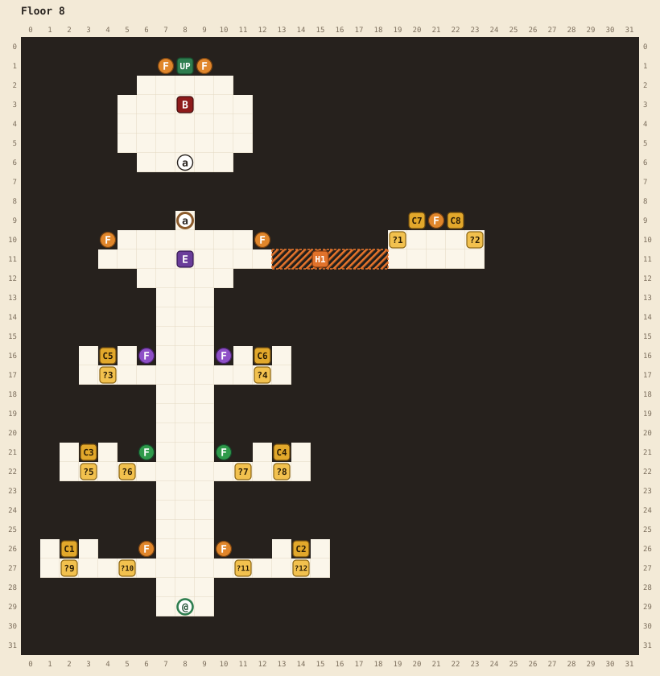

# Floor 8

[Walkthrough](README.md) | Previous: [Floor 7](floor-7.md)

There are no random encounters on this floor, only big fights. Six piles of bones along the central hall mark fights with level 45, ★★★ versions of the bosses of floors 1 to 6, and the beholder at the top of the hall makes seven. Beat all seven and the door to the dragon opens. Six healing mirrors and eight chests help you through, and the best of them are behind the floor's one hidden passage.

## At a glance

| | |
|---|---|
| Arrival | (8,29), at the bottom of the central hall |
| Boss | The dragon, level 60, at (8,3). No level requirement. |
| Mini-bosses | Goblin, gelatinous cube, death knight, and mind flayer at level 45, owlbear and displacer beast at 47, all ★★★ |
| Elite | Beholder, level 55, ★★, at (8,11). On this floor it's required: it counts as the seventh mini-boss. |
| Chests | 8: 3 potions, 3 ethers, an ATK up and a DEF up, 3 haste potions, 3 regen potions, 3 elixirs, 3 more elixirs, 1 potion |
| Magic keys | None found, no locks |
| Healing mirrors | 6, each a full heal, once |
| Hidden passages | 1, optional |
| Random encounters | None |

## Map

See the [legend](README.md#reading-the-maps) for the symbols.

| Pin | Where | What |
|---|---|---|
| @ | (8,29) | Where you arrive |
| a | (8,9) and (8,6) | Door to the dragon. Opens when all seven mini-bosses are beaten. |
| UP | (8,1) | The last stairway. It opens when the dragon falls. Stepping onto it saves your file and rolls the credits. |
| C1 | (2,26) | 3 potions |
| C2 | (14,26) | 3 ethers |
| C3 | (3,21) | 1 ATK up and 1 DEF up |
| C4 | (13,21) | 3 haste potions |
| C5 | (4,16) | 3 regen potions |
| C6 | (12,16) | 3 elixirs |
| C7 | (20,9) | 3 elixirs (secret room) |
| C8 | (22,9) | 1 potion (secret room) |
| ?9 | (2,27) | Mini-boss tile: goblin |
| ?12 | (14,27) | Mini-boss tile: owlbear |
| ?5 | (3,22) | Mini-boss tile: gelatinous cube |
| ?8 | (13,22) | Mini-boss tile: displacer beast |
| ?3 | (4,17) | Mini-boss tile: death knight |
| ?4 | (12,17) | Mini-boss tile: mind flayer |
| ?10, ?11 | (5,27), (11,27) | Healing mirrors, in the wall above: face up and press A |
| ?6, ?7 | (5,22), (11,22) | Healing mirrors |
| ?1, ?2 | (19,10), (23,10) | Healing mirrors (secret room) |
| F | Orange: (6,26), (10,26), (4,10), (12,10), (21,9), (7,1), (9,1). Green: (6,21), (10,21). Purple: (6,16), (10,16). | Burning flames |
| E | (8,11) | The beholder |
| B | (8,3) | The dragon |
| H1 | | Hidden passage, below |

## Hidden passage

| Passage | Start at | Walk | Leads to |
|---|---|---|---|
| H1 | (12,11), the east end of the beholder's hall | right 7 | A secret room with C7 (3 elixirs), C8 (1 potion), and two healing mirrors |

## How the floor works

- Stepping onto a pile of bones brings out its monster, with the roar and the line it greeted you with on its own floor. The fight starts when you close the line. Each of the six fights only once, and a beaten monster's bones dim.
- Each win marks one of seven tiles above the dragon's door. With the seventh, the door opens.
- A healing mirror restores you completely, once: "You look in the mirror and your wounds vanish!" After that it only says "The mirror has lost its luster..." A mirror stays used even if you die and come back.
- There are six mirrors for eight big fights, counting the beholder and the dragon. Use one only when you're hurt, and keep the secret room's pair for last.

## Route

1. **The bottom hall.** Walk up into the first side hall. To the left, the tile at (2,27) is the goblin's. Beat it, open C1 (3 potions) above it, and use the mirror at (5,26) from (5,27) if you need it. To the right, (14,27) is the owlbear's. C2 (3 ethers) is above it, and you use the mirror at (11,26) from (11,27).
2. **The middle hall.** Five steps farther up: the gelatinous cube at (3,22) and the displacer beast at (13,22), with C3 (an ATK up and a DEF up), C4 (3 haste potions), and two more mirrors at (5,21) and (11,21).
3. **The top hall.** Five steps more: the death knight at (4,17) and the mind flayer at (12,17), with C5 (3 regen potions) and C6 (3 elixirs). There are no mirrors on this level. The death knight has a 3 in 16 chance to rise once from its killing blow, so arrive at full health.
4. **The secret room.** Walk up the hall to the beholder's level. From (12,11), east of the beholder, walk right 7 through H1. Open C7 (3 elixirs) and C8 (1 potion), and use the mirrors at (19,9) and (23,9) as you need them.
5. **The beholder.** Face it at (8,11): "STARING EVEN MORE." It's level 55, eight to ten levels above the other six. If it's your seventh win, the door opens.
6. **The dragon.** Go through door a at (8,9). The dragon greets you with "Finally, I have awaited this..." It fights as a three-star monster, but with the far larger HP of a four-star one. See the [bestiary](bestiary.md) for its legendary actions.
7. **The end.** "The dragon is slain! An ancient stairway opens above." Step onto the stairway at (8,1). The game saves your file, with the dragon's XP, and the credits roll. Back on the file screen, a crown marks the file as cleared.
